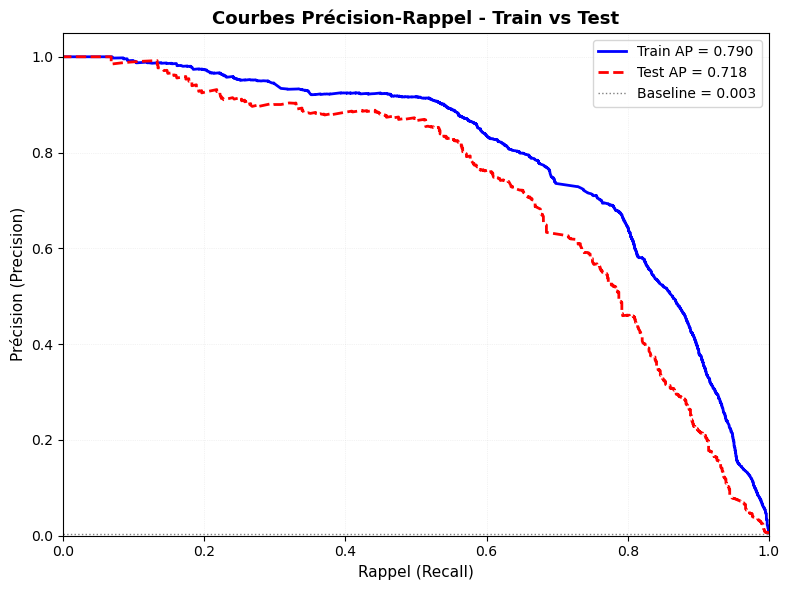
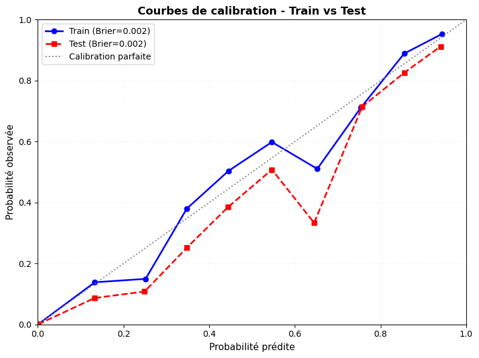
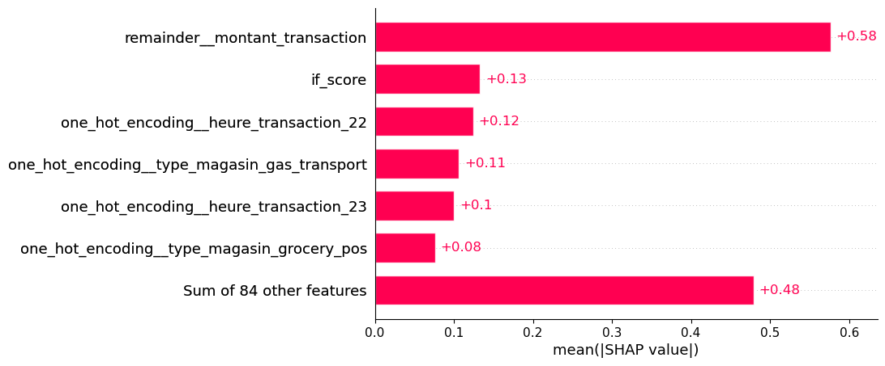
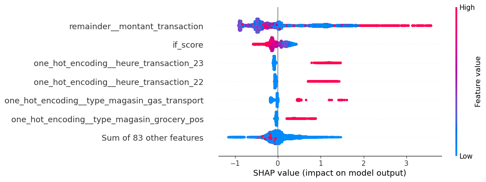
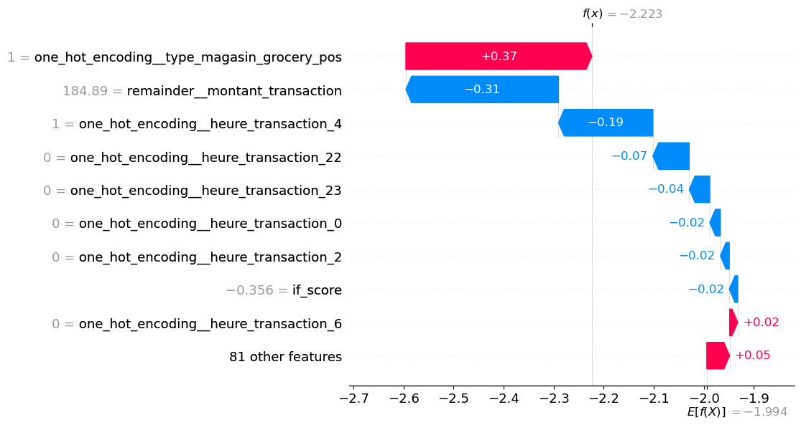
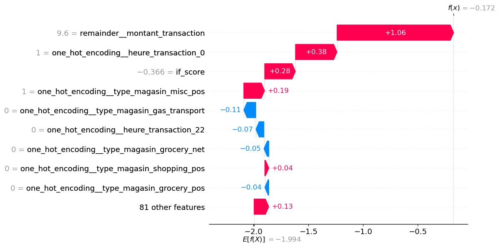
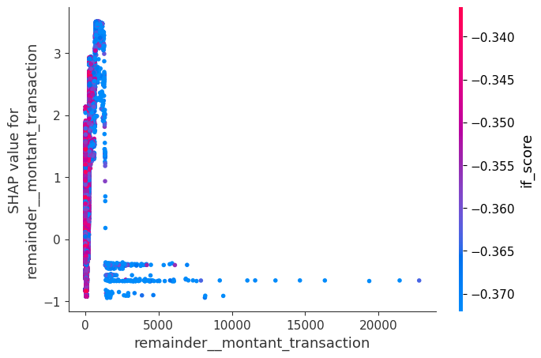

# Détection de fraude sur transactions par carte bancaire

## 1. Contexte

Ce projet porte sur la détection de **transactions frauduleuses** à partir d’un jeu de données simulé issu de Kaggle.

Le dataset contient environ **1,85 million de transactions** réalisées entre 2019 et 2020, avec une forte asymétrie : une majorité écrasante de transactions légitimes et un taux de fraude d’environ **0,05 %**.

Malgré ce faible taux, les enjeux restent importants : **pertes financières**, **coûts opérationnels** et **dégradation de l’expérience client**. L’objectif est donc de détecter efficacement les fraudes tout en limitant les faux positifs.

## 2. Objectif

Mettre en place un **pipeline complet de détection de fraude** couvrant l’ensemble des étapes : préparation des données, analyse exploratoire, modélisation, interprétation et mise à disposition via une application.

Au-delà de la performance pure du modèle, l’objectif est de construire une solution **exploitable en contexte réel**, capable de s’intégrer dans un processus opérationnel.

Cela implique de trouver un compromis réaliste entre :
- la capacité à détecter un maximum de fraudes  
- la limitation des faux positifs pour éviter une surcharge opérationnelle  
- la préservation de l’expérience client  

Le projet s’inscrit ainsi dans une logique **orientée métier**, où les décisions du modèle sont évaluées à la fois sur des métriques statistiques et leur **impact économique**.

## 3. Données

Source : Kaggle  
https://www.kaggle.com/datasets/kartik2112/fraud-detection

Le dataset contient des transactions simulées mais construites pour reproduire des comportements réalistes.

Caractéristiques principales :
- données transactionnelles bancaires  
- période 2019–2020  
- classification binaire (**fraude vs non fraude**)  
- **très fort déséquilibre**  

Les données couvrent plusieurs dimensions de la transaction :

- **dimension temporelle** : `trans_date_trans_time` (date et heure de la transaction)  
- **dimension financière** : `amt` (montant de la transaction)  
- **dimension client** : `city`, `state`, `job`, `dob`  
- **dimension commerçant** : `merchant`, `category`  
- **dimension géographique** : `lat`, `long`, `merch_lat`, `merch_long`  
- **identifiants techniques** : `cc_num`, `trans_num`, `unix_time`  
- **variable cible** : `is_fraud`  

Ces variables permettent de capturer à la fois le contexte de la transaction, le profil du client et les caractéristiques du commerçant, éléments essentiels pour détecter des comportements frauduleux.

## 4. Méthodologie

### Préparation des données

Cette étape vise à transformer les données brutes en une base exploitable pour l’analyse et la modélisation.

- fusion des fichiers train et test afin de garantir une cohérence temporelle  
- nettoyage des données et typage des variables (dates, catégories, numériques)  
- renommage des variables pour améliorer la lisibilité métier  
- suppression des variables inutiles, redondantes ou sensibles  
- création de variables dérivées :
  - variables temporelles (`heure_transaction`, `jour_transaction`, `mois_transaction`)  
  - âge du client (`age_client`)  
  - distance domicile–magasin (`distance_domicile_magasin`)  

Ces transformations permettent d’enrichir l’information disponible tout en réduisant le bruit.

---

### Analyse exploratoire

Objectifs :

- comprendre la structure des données  
- identifier les variables discriminantes  
- vérifier la **stabilité temporelle**  

Principaux résultats :

- taux de fraude très faible (~0,05 %) confirmant un problème fortement déséquilibré  
- variables les plus discriminantes :
  - `montant_transaction`  
  - `heure_transaction`  
  - `type_magasin`  
- identification et suppression de variables peu informatives, trop bruitées ou fortement sparsées  

Cette étape permet de guider les choix de modélisation et de limiter le risque de surapprentissage.

---

### Stratégie de validation

Le découpage des données est réalisé de manière **strictement chronologique** :

- train : 2019  
- validation : janvier à septembre 2020  
- test : octobre à décembre 2020  

Ce choix permet de reproduire un scénario réaliste où le modèle est entraîné sur le passé et appliqué sur des données futures.

Il permet également :

- d’éviter toute fuite d’information entre les jeux de données  
- de capturer d’éventuels effets de **drift temporel**  
- d’évaluer le modèle dans des conditions proches de la production  

La validation est complétée par des techniques de type **TimeSeriesSplit**, renforçant la robustesse de l’évaluation.

### Modélisation

Le pipeline repose sur les étapes suivantes :

- encodage des variables catégorielles  
- ajout d’un score d’anomalie via **Isolation Forest (`if_score`)**  
- modèle principal : **XGBoost**  
- tuning des hyperparamètres  

L’intégration de l’Isolation Forest permet de capturer le caractère **atypique** des transactions.  
Dans un contexte fortement déséquilibré, ce signal non supervisé apporte une information complémentaire pertinente pour identifier des comportements rares.

Le modèle **XGBoost** est retenu pour sa capacité à modéliser des **relations non linéaires** et des **interactions complexes**, particulièrement adaptées aux problématiques de fraude.

Les hyperparamètres sont optimisés avec un focus sur la **stabilité des probabilités**, en utilisant le **Brier score** comme critère.  
Ce choix permet de limiter le surapprentissage et d’obtenir des probabilités cohérentes, indispensables pour la phase de décision.

La validation repose sur un **TimeSeriesSplit**, garantissant l’absence de fuite d’information et une cohérence avec un contexte de détection en temps réel.

---

### Calibration et seuil

Deux éléments structurants :

**Calibration des probabilités**

Une calibration est appliquée afin d’obtenir des probabilités **fiables et interprétables**.  
C’est un point critique, car ces probabilités sont directement utilisées pour la prise de décision.

**Optimisation du seuil**

Le seuil est optimisé selon une **fonction de coût métier** :

- faux positif : 25 €  
- faux négatif : 125 €  

L’objectif est de minimiser le **coût total**, et non une métrique purement statistique.

Ce choix reflète une logique opérationnelle :  
une fraude non détectée étant nettement plus coûteuse qu’une fausse alerte, le modèle est orienté vers un bon **rappel**, tout en maîtrisant le volume d’alertes.

---

## 5. Résultats

Le modèle présente des performances élevées, à la fois en termes de métriques ML et d’impact métier :

- ROC-AUC ≈ **0,99**  
- Recall ≈ **78,5 %** (≈ 8 fraudes sur 10 détectées)  
- Précision ≈ **51 %** (≈ 1 alerte sur 2 pertinente)  
- Alert rate ≈ **0,51 %** des transactions  

Le **seuil optimal (0,226)** est déterminé sur l’échantillon de validation en minimisant le coût.

Appliqué au jeu de test, il conduit à un **coût total d’environ 134 675 €**, traduisant un compromis efficace entre faux positifs et faux négatifs.

Ces résultats montrent que le modèle :

- détecte une part importante des fraudes  
- génère un volume d’alertes maîtrisé  
- reste cohérent avec les contraintes opérationnelles  

Un **drift du taux de fraude** est observé entre validation et test (≈ 0,05 % → ≈ 0,03 %).  
Ce phénomène explique :

- une baisse de la précision  
- un seuil devenu légèrement trop permissif  

Un ajustement du seuil serait donc nécessaire en production pour rester optimal.

---

## 6. Interprétabilité du modèle (SHAP)

Le modèle est analysé avec **SHAP** afin de comprendre ses décisions, à la fois au niveau global et individuel.

### Importance globale

Variables principales :

- `montant_transaction`
- `heure_transaction`
- `if_score`
- `type_magasin`

L’importance globale montre que le modèle repose principalement sur des variables liées :
- au **comportement transactionnel** (montant, heure)  
- à l’**anomalie** (`if_score`)  
- au **contexte commerçant** (`type_magasin`)  

Le **montant de la transaction** apparaît comme le facteur le plus structurant, avec un impact moyen nettement supérieur aux autres variables.

### Effets moyens

L’analyse des contributions (beeswarm) permet de comprendre comment les variables influencent le score de fraude :

- des **montants atypiques** (très faibles ou très élevés) ont un impact positif sur le risque  
- les montants intermédiaires sont davantage associés à des transactions légitimes  
- certaines **plages horaires** (notamment tard le soir) augmentent significativement le score  
- un **`if_score` faible** (transaction jugée anormale) est fortement corrélé à la fraude  

On observe également une **dispersion importante des contributions**, ce qui indique que l’effet des variables dépend fortement du contexte global.

### Explications locales

Chaque décision du modèle est **interprétable individuellement**, ce qui permet d’expliquer précisément une alerte ou une non-alerte.

Transaction non frauduleuse :
- comportement **cohérent avec l’historique**  
- montant typique  
- score d’anomalie rassurant  
→ contribution globale négative vers la fraude  

Transaction frauduleuse :
- comportement **atypique**  
- montant inhabituel  
- score d’anomalie élevé  
→ accumulation de contributions positives vers la fraude  

Ces exemples illustrent que la décision repose sur une **combinaison de facteurs**, et non sur une seule règle simple.

### Interactions

Le modèle ne suit pas une logique linéaire du type *“gros montant = fraude”*.  
Il combine plusieurs variables pour estimer le risque.

Le graphique d’interaction montre que :

- un même **montant** peut être risqué ou non  
- cela dépend du **score d’anomalie**, de l’**heure** ou du **type de magasin**  
- les effets sont **non linéaires et contextuels**  

Cela confirme que le modèle capte des **patterns de fraude complexes**, proches de comportements réels.

## 7. Pipeline

Le projet est structuré sous forme de **pipeline exécutable** :

`full_fraud_detection_projet()`

Cette fonction permet de lancer l’ensemble du workflow de manière **séquentielle, reproductible et contrôlée**, depuis les données brutes jusqu’au modèle final.

Le pipeline enchaîne les étapes suivantes :

- **feature engineering et premier nettoyage** des données  
- **nettoyage post-EDA**, basé sur les choix d’analyse (sélection de variables, regroupements)  
- **modélisation complète** :
  - preprocessing  
  - entraînement  
  - calibration des probabilités  
  - optimisation du seuil  

Chaque étape est implémentée sous forme de fonctions dédiées, ce qui permet de **séparer clairement les responsabilités** et de faciliter la maintenance.

Cette organisation présente plusieurs avantages :

- **reproductibilité complète des résultats**  
- cohérence entre les différentes phases du projet  
- réutilisation des briques dans d’autres contextes (notebooks, application)  
- transition naturelle vers une logique **MLOps**  

Le pipeline matérialise ainsi le passage d’un travail exploratoire à une structure **modulaire et proche des standards industriels**.

## 8. Structure du projet

- `01_data` : données brutes et données transformées  
- `02_notebooks` : notebooks d’analyse (feature engineering, EDA, modélisation, interprétation)  
- `03_fonctions` : fonctions réutilisables (cleaning, pipeline ML, utilitaires)  
- `04_model` : modèles sauvegardés et artefacts  
- `05_visualisations` : graphiques utilisés dans le projet et le README  
- `06_streamlit` : application interactive  
- `full_pipeline.py` : orchestration complète du projet  

Cette structure permet de séparer clairement les phases **exploratoires** des composants **réutilisables**, facilitant la maintenance et l’évolution du projet.

## 9. Application Streamlit

Une application interactive permet de rendre le modèle exploitable dans un **contexte métier réel**.

Elle constitue une interface entre le modèle et les utilisateurs, en facilitant l’accès aux résultats et leur interprétation.

Fonctionnalités :

- visualisation des **performances du modèle**  
- analyse du **coût en fonction du seuil de décision**  
- explicabilité des décisions via **SHAP**  
- simulation de transactions en temps réel  

Une brique d’**IA générative (LLM Sonar - Perplexity)** est intégrée afin de traduire les explications techniques en **langage naturel**, facilitant leur compréhension par des utilisateurs non techniques.

L’application permet ainsi :

- de **justifier une alerte**  
- d’**expliquer une décision**  
- d’**aider à l’ajustement du seuil**  

Elle transforme le modèle en un véritable **outil d’aide à la décision**, directement utilisable par des profils métier.

## 10. Conclusion

Le modèle présente une **forte capacité de discrimination**, une **bonne cohérence probabiliste** et un compromis pertinent entre **détection des fraudes** et **coût opérationnel**.

Il permet de détecter une part significative des fraudes tout en maintenant un **volume d’alertes maîtrisé**, compatible avec une utilisation en conditions réelles.

Son exploitation nécessite toutefois un **ajustement du seuil de décision** en fonction de l’évolution du taux de fraude et du contexte métier.

Ce projet illustre le passage d’une approche exploratoire à une solution **structurée, reproductible et orientée métier**, intégrant à la fois :
- des considérations statistiques  
- des contraintes économiques  
- des enjeux opérationnels  

L’ensemble constitue une base solide pour une **mise en production** ou des développements futurs (monitoring, gestion du drift, amélioration des features).